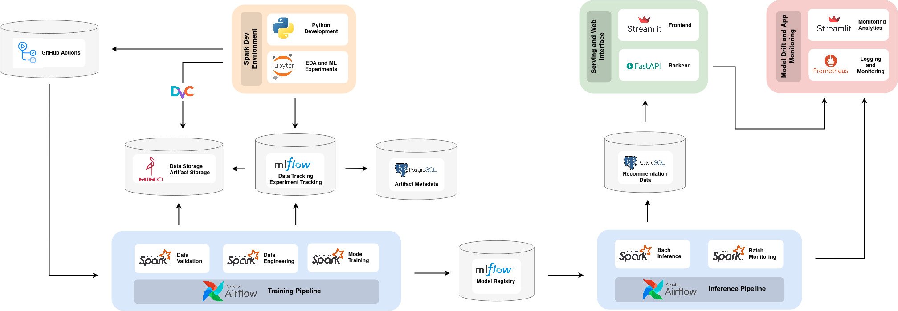
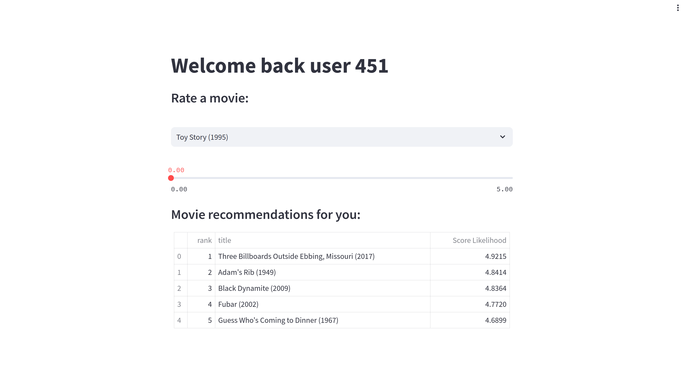
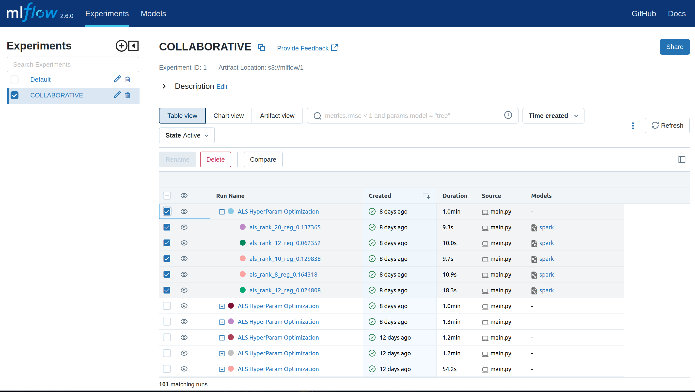
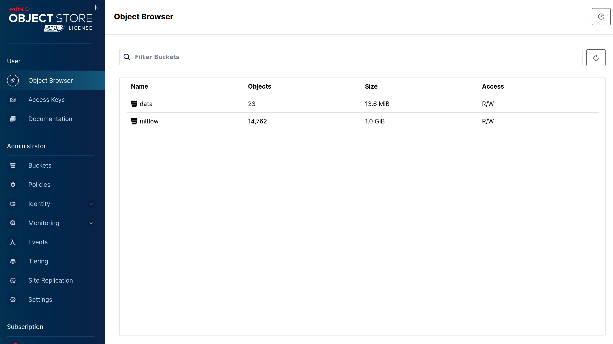
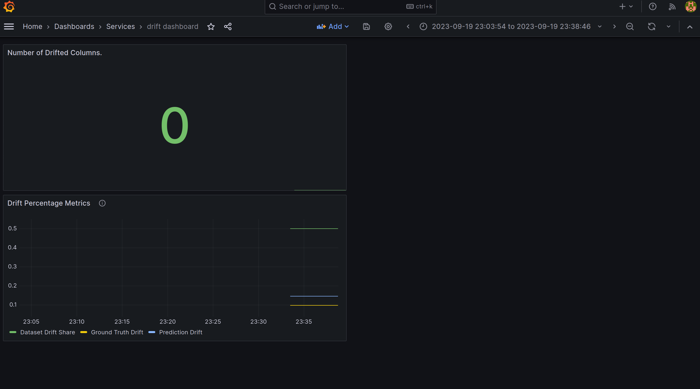
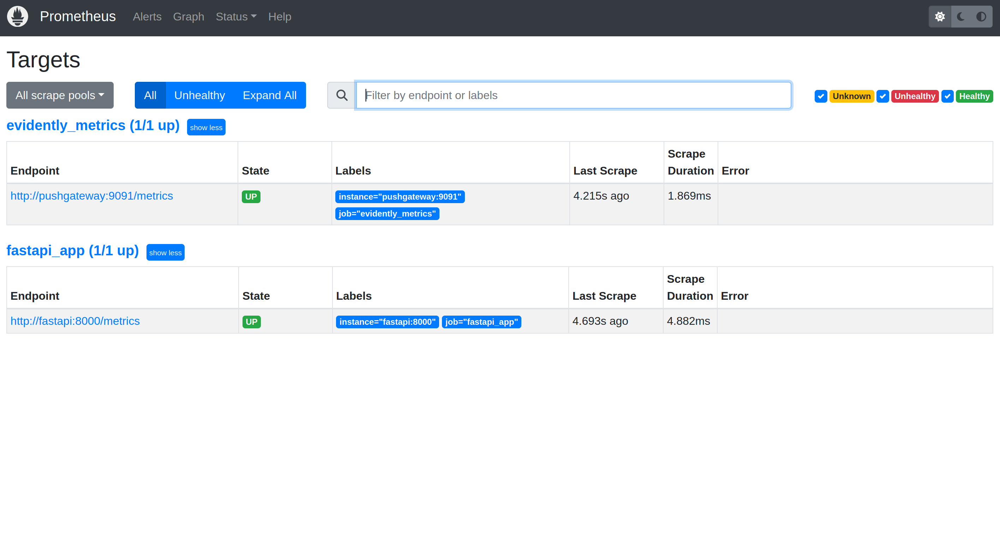
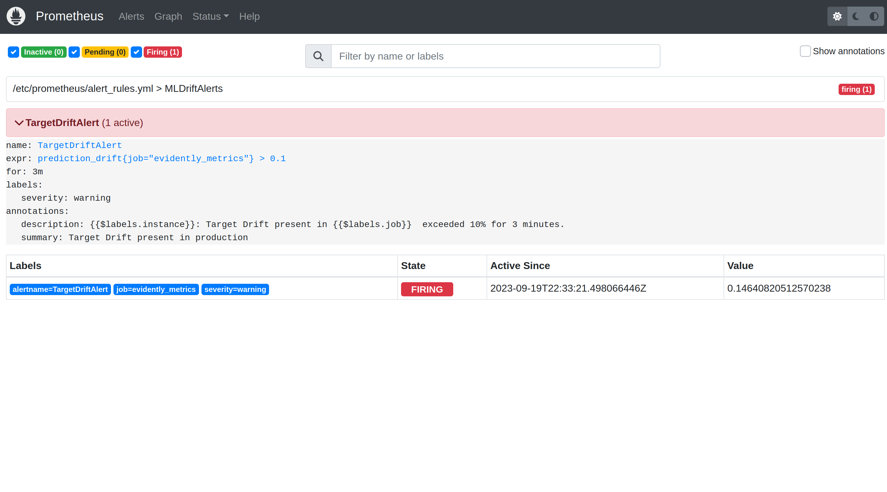

<!-- Next Watch
==============================

MLOps  MLOps project for movie recommendations. -->

<p align="center">

</p>

# Next Watch: E2E MLOps Pipelines with Spark!


<p><small><a href="#prereq">Prerequisites</a> | <a href="#inst">Quick Start</a> | <a href="#endpoints">Service Endpoints</a> | <a href="#architecture">Architecture</a> | <a href="#organization">Project Organization</a> | <a href="#showcase">UI Showcase</a>. 

<h2 id="prereq"> Prerequisites </h2>
- Python
- Conda or Venv
- Docker

<h2 id="inst"> Installation and Quick Start </h2>
1. Clone the repo
```sh
git clone https://github.com/brnaguiar/mlops-next-watch.git
```

2. Create environment
```sh
make env
```

3. Activate conda env
```sh
source activate nwenv
```

4. Install requirements / dependencies and assets
```sh
make dependencies
```

5. Pull the datasets
```sh
make datasets
```

6. Configure containers and secrets
```sh
make init
```

7. Run Docker Compose
```sh
make run
```

8. Populate production Database with users
```sh
make users
```

<h2 id="endpoints"> Useful Service Endpoints </h2>
```
- Jupyter `http://localhost:8888`
- MLFlow `http://localhost:5000`
- Minio Console `http://localhost:9001`
- Airflow `http://localhost:8080`
- Streamlit Frontend `http://localhost:8501`
- FastAPI Backend` http://localhost:8000/`
- Grafana Dashboard `http://localhost:3000`
- Prometheus `http://localhost:9090`
- Pushgateway `http://localhost:9091`
- Spark UI `http://localhost:8081`
```

<h2 id="architecture"> Architecture </h2>



<!-- PROJECT LOGO -->
<h2 id="organization"> Project Organization </h2>
------------

    ├── LICENSE
    │
    ├── Makefile             <- Makefile with commands like `make env` or `make run`
    │
    ├── README.md            <- The top-level README for developers using this project
    │
    ├── data
    │   ├── 01-external      <- Data from third party sources
    │   ├── 01-raw           <- Data in a raw format
    │   ├── 02-processed     <- The pre-processed data for modeling
    │   └── 03-raw           <- Splitted Pre-Processed data for model training
    ├── airflow
    │   ├── dags             <- Airflow Dags
    │   ├── logs             <- Airflow logging
    │   ├── plugins          <- Airflow default directory for Plugins like Custom Operators, Sensors, etc... (however, we use the dir `include` in dags for this purpose)
    │   └── config           <- Airflow Configurations and Settings
    │
    ├── assets               <- Project assets like jar files used in Spark Sessions
    │
    ├── models               <- Trained and serialized models, model predictions, or model summaries
    │
    ├── notebooks            <- Jupyter notebooks used in experimentation 
    │
    ├── docker               <- Docker data and configurations
    │
    ├── images               <- Project images
    │
    ├── requirements.local   <- Required Site-Packages 
    │                         
    ├── requirements.minimal <- Required Dist-Packages 
    │                         
    ├── Makefile             <- File containing rules and dependencies to automate building processes
    │
    ├── setup.py             <- makes project pip installable (pip install -e .) so src can be imported 
    │
    ├── src                  <- Source code for use in this project.
    │   │
    │   ├── collaborative    <- Source code for the collaborative recommendation strategy
    │   │   └── models       <- Collaborative models
    │   │   └── nodes        <- Data processing, validation, training, etc. functions (or nodes) that represent units of work.
    │   │   └── pipelines    <- Collection of orquestrated data processing, validation, training, etc. nodes, arranged in a sequence or a directed acyclic graph (DAG)
    │   │
    │   ├── conf           <- Configuration files and parameters for the projects
    │   │
    │   ├── main.py        <- Main script, mostly to run pipelines
    │   │
    │   ├── scripts        <- Scripts, for instance, to create credentials files and populate databases
    │   │   ├── predict_model.py
    │   │   └── train_model.py
    │   │
    │   └── frontend       <- Source code for the Application Interface
    │   │
    │   └── utils          <- Project utils like Handlers and Controllers
    │
    └── tox.ini            <- Settings for flake8
    │
    └── pyproject.toml     <- Settings for the project, and tools like isort, black, pytest, etc.


<h2 id="showcase"> UI Showcase </h2>

### Streamlit Frontend App


### MLflow UI


### Minio UI


### Airflow UI


### Grafana UI


### Prometheus UI


### Prometheus Drift Detection Example


<!-- #4. Create a `.env` file (`.env` sample below)#
5. Run the the project!
```sh
make run
```
-->

--------


<p><small>Project based on the <a target="_blank" href="https://drivendata.github.io/cookiecutter-data-science/">cookiecutter data science project template</a>. 

<!-- #cookiecutterdatascience</small></p> -->
